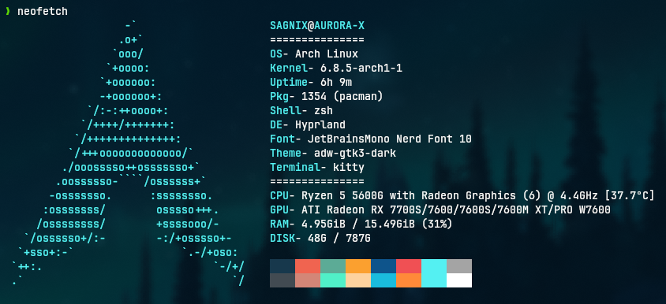

# NEO



## INSTALL
* clone repo and change directory
  ```bash
  git clone https://github.com/i-sagnix/neo.git && cd neo
* copy config file
  ```
  cp -R neofetch ~/.config/
* DONE

## RUN
  ```
  neofetch
