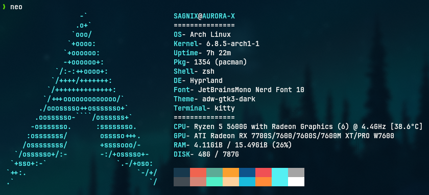

# NEO



## INSTALL
* clone repo and change directory
  ```bash
  git clone https://github.com/i-sagnix/neo.git && cd neo
* copy config file
  ```
  cp -R neofetch ~/.config/
* DONE

## (OPTIONAL)
* create an alias in your shell (i use ZSH)
  , add the line in ~/.zshrc
  ```
  alias neo="neofetch"
____

## RUN
  ```
  neofetch
